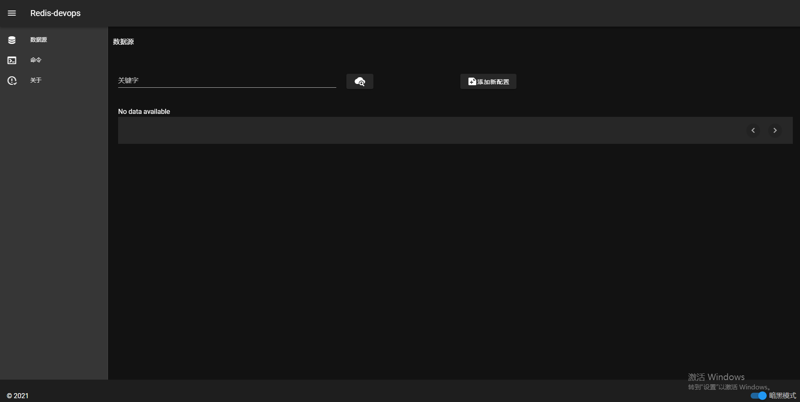

# redis-devops-ui

## 跑这个例子
```
npm install
npm run serve
```

### 打包
```
npm run build
```

### 检查格式
```
npm run lint
```

### 说明

使用vue + VueRouter + vuetify (UI) + axios(网络)

这是[redis-devops](https://github.com/lishiyuandage/redis-devops)的前端页面内容。为了方便大家修改。

### 长这样



